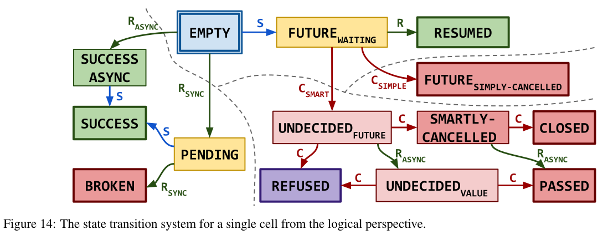
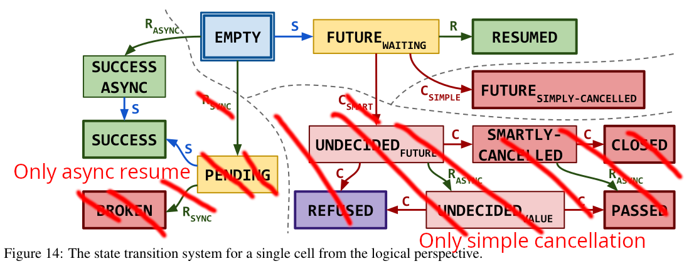

# Verifying an Effect-Based Cooperative Concurrency Scheduler in Iris

## Sections

1. Introduction
2. Simple Scheduler (with axiomatized CQS)
3. Towards a Multi-Threaded Scheduler
4. Using Multi-Threading to verify an Adaptation of CQS
5. Extending the Scheduler with Thread-Local variables
6. A Note on Cancellation
7. Evaluation
8. Conclusion

# 1. Introduction

- As a motivation for the work: program verification, safety and why we care about it.
- Iris and how we can prove safety
- Eio and how it provides concurrency primitives
- Effect Handlers with a simple example
- Effect Handler formalization in Iris using protocols

## Simple Scheduler

- The simplified code of the mock scheduler that Eio provides (actual schedulers differ per OS and intergrate with OS primitives)
- What is the difference between this scheduler and the one from Paolo's paper  
  The gist is that using a concurrent queue and handling promises in the fibers allows many simplifications in the scheduler & the logical state.
- Explain how the Fork/Suspend effect work and how fibers use them.
- Explain how the scheduler implements these effects.
- What are the safety concerns in this implementation (mainly in the implementation for await)
- What logical state in Iris do we use to model the behavior.
- What are some interesting parts of the proofs.

<!-- #### Verification of Promises using CQS

Now that we have outlined how the operations work we want to explain the code of Eio's promise in more detail.
Since the code is lock-free there are a couple of interleavings the implementation must take care of.

We recall that when awaiting a promise, a fiber first checks if the promise is already fulfilled by atomically loading its state.
If it is not fulfilled, the fiber then performs a `Suspend` effect and starts a suspend operation, providing the `waker` of the `Suspend` effect as the handle.
The suspend operation might fail because the promise could have been fulfilled concurrently.
Since the promise could have been fulfilled in the meantime, the fiber must then again atomically load the state of the promise.

- If it has not been fulfilled the fiber does not need to do anything because it will eventually be woken up by a resume all operation invoking the `waker`.
- But if the promise has been fulfilled the fiber must attempt to cancel the suspend operation.
  That is because in this situation the suspend operation races with a concurrent resume all operation, which might already have invoked all `waker`s **before** this fiber was able to save its `waker` in the broadcast.
  In this case the `waker` would be lost and the fiber never resumes execution.
  If the `waker` has not been invoked yet (either because resume all has not arrived at this waker or it arrived before the waker was saved in the broadcast) the cancellation attempt succeeds and the fiber invokes its own `waker`.
  Otherwise we know that the `waker` has already been invoked, so the fiber does not need to do anything.

This complicated interplay between two fibers is due to CQS being lock-free but it ensures that fibers only resume execution when the promise is fulfilled as we saw in section 1 and that all `waker`s will be eventually called.

```
Aside: All wakers are eventually called.
This statement is purely based on a reading of the code. It might be possible to formally prove this with an approach
like Iron [ref] or Transfinite Iris [ref] because it is a liveness property.
But at least for the Iron approach
``` -->

## Towards A Multi-Threaded Scheduler

OCaml 5 added not only effect handlers but also the ability to use multiple threads of execution, which are called _domains_ (in the following we use the terms interchangeably).
Each domain in OCaml 5 corresponds to one system-level thread and the usual rules of multi-threaded execution apply, i.e. domains are preemtively scheduled and can share memory.
Eio defines an operation to make use of multi-threading by forking off a new thread and running a separate scheduler in it.
So while each Eio scheduler is only responsible for fibers in a single thread, fibers can await and communicate with fibers running in other threads.

In order for a fiber to be able to await fibers in another thread, the `wakers_queue` [note it will be in the Simple Scheduler section] from above is actually a thread-safe queue based on something called CQS, which we will discuss in detail in a later section.

Heaplang supports reasoning about multi-threaded programs by implementing fork and join operations for threads and defining atomic steps in the operational semantics, which enables the use of Iris _invariants_.
In contrast, Hazel did not define any multi-threaded operational semantics but it contained most of the building blocks for using invariants.
In the following we explain how we added a multi-threaded operational semantics and enabled the use of invariants.

```
Aside: Memory Model in OCaml 5
In the OCaml 5 memory model, *atomic variables* are needed in order to access shared memory without introducing data races.
Instead of modelling atomic variables in Hazel, we continue to use normal references because the multi-threaded operational semantics by definition defines all memory operations to be sequentially consistent. This seems to be the standard approach and is done the same way in Heaplang.
```

### Adding Invariants to Hazel

Invariants in Iris are used to share resources between threads.
They encapsulate a resource to be shared and can be opened for a single atomic step of execution.
During this step the resource can be taken out of the invariant and used in the proof but at the end of the step the invariant must be restored.

Hazel did already have the basic elements necessary to support using invariants.
It defined a ghost cell to hold invariants and proved an invariant access lemma which allows opening an invariant if the current expression is atomic.
In order to use invariant we only had to provide proofs for which evaluation steps are atomic.
We provided proofs for all primitive evaluation steps.
The proofs are the same for all steps so we just explain the one for `Load`.

```coq
Lemma ectx_language_atomic a e :
  head_atomic a e → sub_exprs_are_values e → Atomic a e.

Instance load_atomic v : Atomic StronglyAtomic (Load (Val v)).
Instance store_atomic v1 v2 : Atomic StronglyAtomic (Store (Val v1) (Val v2)).
...
```

An expression is atomic if it takes one step to a value, and if all subexpressions are already values.
The first condition follows by definition of the step relation and the second follows by case analysis of the expression.

Since performing an effect starts a chain of evaluation steps to capture the current continuation, it is not atomic.
For the same reason an effect handler and invoking a continuation are not atomic except in degenerate cases.
Therefore, invariants and effects do not interact in any interesting way.

[TODO How we add support for the iInv tactic to use invariants more easily.]

### Adding Multi-Threading to Hazel

To allow reasoning in Hazel about multi-threaded programs we need a multi-threaded operational semantics as well as specifications for the new primitive operations `Fork`, `Cmpxcgh` and `FAA`.

The language interface of Iris provides a multi-threaded operational semantics that is based on a thread-pool.
The thread-pool is a list of expressions that represents threads running in parallel.
At each step, one expressions is picked out of the pool at random and executed for one thread-local step.
Each thread-local step additionally returns a list of forked-off threads, which are then added to the pool.
This is only relevant for the `Fork` operation as all other operations naturally don't fork off threads.

```
(e, \sigma) ->_t (e', \sigma', es')
------------------------------------------------------------
(es_1 ++ e ++ es_2, \sigma) ->_mt (es_1 ++ e' ++ es_2 + es', \sigma')
```

Heaplang implements multi-threading like this and for Hazel we do the same thing.
We adapt Hazel's thread-local operational semantics to include `Fork`, `Cmpxchg` and `FAA` operations and to track forked-off threads and get a multi-threaded operational semantics "for free" from Iris' language interface.

[TODO one of the proofs that the language interface requires was a bit tricky so include that.]

Additionally, we need to prove specifications for these three operations.
`Cmpxchg` and `FAA` are standard so we will not discuss them here.
The only interesting design decision in the case of Hazel is how effects and `Fork` interact.
This decision is guided by the fact that in OCaml 5 effects never cross thread-boundaries.
An unhandled effect just terminates the current thread.
As such we must impose the empty protocol on the argument of `Fork`.

```
EWP e <| \bot |> { \top }
-------------------------------------
EWP (Fork e) <| \Phi |> { x, x = () }
```

[TODO explain how that proof works.]

Using these primitive operations we can then build the standard `CAS`, `Spawn`, and `Join` operations on top and prove their specifications.
For `Spawn` & `Join` we already need invariants as the point-to assertion for the done flag must be shared between the two threads.

```
Lemma spawn_spec (Q : val → iProp Σ) (f : val) :
  EWP (f #()) <| \bot |> {{ Q }} -∗ EWP (spawn f) {{ v, ∃ (l: loc), ⌜ v = #l ⌝ ∗ join_handle l Q }}.

Lemma join_spec (Q : val → iProp Σ) l :
  join_handle l Q -∗ EWP join #l {{ v, Q v }}.

Definition spawn_inv (γ : gname) (l : loc) (Q : val → iProp Σ) : iProp Σ :=
  ∃ lv, l ↦ lv ∗ (⌜lv = NONEV⌝ ∨
                  ∃ w, ⌜lv = SOMEV w⌝ ∗ (Q w ∨ own γ (Excl ()))).

Definition join_handle (l : loc) (Q : val → iProp Σ) : iProp Σ :=
  ∃ γ, own γ (Excl ()) ∗ inv N (spawn_inv γ l Q).
```

Note that for `Spawn` we must also impose the empty protocol on `f` as this expression will be forked-off.

This allows us to implement standard multi-threaded programs which also use effect handlers.
For example, we can prove the specification of the function below that is based on an analogous function in Eio which forks a thread and runs a new scheduler inside it.
Note that same as in Eio the function blocks until the thread has finished executing, so it should be called in separate fiber.

```
Definition spawn_scheduler : val :=
  (λ: "f",
    let: "new_scheduler" := (λ: <>, run "f") in
    let: "c" := spawn "new_scheduler" in
    join "c")%V.

Lemma spawn_scheduler_spec (Q : val -> iProp Σ) (f: val) :
  promiseInv -∗ EWP (f #()) <| Coop |> {{ _, True }} -∗
    EWP (spawn_scheduler f) {{ _, True }}.
```

The scheduler `run` and therefore also the `spawn_scheduler` function don't have interesting return values, so this part of the specification is uninteresting.
What is more interesting is that they encapsulate the possible effects the given function `f` performs.

## Verifying Eio's Customized CQS

<!-- What is CQS and how does Eio use it? -->

CQS [ref] is a formally verified implementation of a synchronization primitive which allows execution contexts to stop execution until signalled.
The exact nature of the execution context is abstracted away but it must support stopping and resuming execution.
In the case of Eio an execution context is an Eio fiber but nevertheless CQS works across multiple threads, so fibers can use CQS to synchronize with fibers running in another thread.
Eio uses a custom version of CQS adapted from the paper [ref] in the form of the `Broadcast` module from section 1.
In this section we mainly describe the behavior of Eio's _customized CQS_ (or `Broadcast` module), highlight differences to the _original CQS_, and discuss how we adapted the verification of the original CQS for our case study.
If something applies to both the customized and original version we just use the term _CQS_.

<!-- How does CQS work? -->

#### Operations in CQS

The original CQS supports three operations that are interesting to us.
In a _suspend operation_ the requesting execution context wants to wait until signalled so it places a handle to itself in the datastructure and stops execution afterwards.
But before it actually stops execution it can try to cancel the suspend operation using the _cancel operation_.
Finally, a _resume operation_ can be done from a difference execution context.
It takes one handle out of the datastructure and tries to resume execution of the associated execution context, passing it the value that was provided to the resume operation.
This fails if the suspend operation had already been cancelled.

<!-- Here we call back to how the operations described above are used to implement promises/broadcast. -->

Eio's customized CQS supports a new operation called the _resume all operation_.
As the name implies, it is a resume operation that applies to all currently saved handles.
This operation was added to support Eio's _promise_ functionality, which allows fibers to wait for the completion of another fiber and retrieve its final value.
When a promise is fulfilled all waiting fibers must be signalled so that they can continue execution.

```
Aside: Implementation of resume_all
Eio implements resume_all on the level of the infinite array (more on that below).
Because of technical differences between the infinte array implementation in the CQS mechanization & the infinite array implementation of Eio we were not able to verify Eio's custom resume_all function.
For our case study we actually define resume_all simply as a loop over a resume operation.
By analyzing the code of Eio we conclude that Eio's resume_all and our resume_all have the same behavior which is why we argue that the verification is still valid.
[TODO If time permits we will verify Eio's resume_all and remove this aside.]
```

<!--  -->

#### Implementation and Logical Interface of CQS

CQS is implemented as a linked list of _cells_ forming a queue since insertion and removal follows a FIFO order.
It has two pointers pointing to the beginning and end of the list, the _suspend pointer_ and the _resume pointer_.
Since CQS is multi-threaded and lock-free, during a suspend or resume operation the respective cell pointer is atomically updated to the next cell to ensure that each cell is only handled once.

There is a logical resource called the `thread_queue_state`, which tracks the number of cells, i.e. the length of the queue.
This logical state is supposed to be kept in an invariant and updated when some outer atomic variable is accessed.
In the case of Eio, this outer atomic variable is the location that holds the result of the promise.
Updating the `thread_queue_state` involves

- enqueue & dequeue registration to update the state of the CQS at some outer atomic variable as a synchronization point.

<!-- Next we talk about how we adapted the existing verification of CQS to use it in our scheduler proof. -->

#### Specification of the Operations

In the following we describe the specifications we proved for the three operations `suspend`, `cancel` and `resume_all`, in which points they differ from the specifications of the original CQS operations, and what changes we did to the logical state of CQS to carry out the proofs.

<!-- Make a small aside to talk about full CQS -->

First we want to mention that the original CQS supports a couple of additional features like a synchronous mode for suspend and resume, and also a smart cancellation mode.
These features blow up the state space of CQS and complicate the verification but are not used in Eio so when we ported the verification of CQS to our Eio case study we removed support for these features.
Due to this, the part of the verification of the original CQS that we had to customize for Eio shrunk by approximately 1300 lines of Coq code from the original 3600 lines of Coq code.

Also, this reduced the state space of the original CQS shown below (taken from the original paper) to something more manageable for us when understanding the proofs. [TODO clean up diagram and replace FUTURE by CALLBACK]




The first major change was replacing the future-based interface of the suspend operation with a callback-based interface.
In the original CQS, doing a suspend operation creates a future, saves it in the datastructure as the handle and returns it.
The execution context can then use the future to stop execution because it is assumed there is a runtime that allows suspending until the completion of a future.
But Eio cannot use this interface because it uses the customized CQS to _build_ the runtime that allows fibers to suspend until the completion of a promise.
Instead, Eio implements CQS with a callback-based interface where the fiber doing the suspend operation passes in a callback as the handle and afterwards the fiber implicitly stops execution.
Doing a resume operation analogously invokes the callback, instead of completing the future.
Concretely, Eio's _promise_ uses the `Suspend` effect to stop execution of the fiber and passes the `waker` as the callback so that on invokation the fiber resumes execution.

This changes the logical state of CQS only slightly.
The original CQS tracked the state of the future for each cell and managed _futureCancellation_ and _futureCompletion_ tokens.
In the customized CQS we track the state of the callback for each cell and manage _callbackInvokation_ and _callbackCancellation_ tokens.

##### _suspend operation_

The suspend operation takes a _suspension permit_

```coq
Theorem suspend_spec γa γtq γe γd γres e d k:
  {{{ is_thread_queue γa γtq γe γd γres e d ∗
      suspension_permit γtq ∗
      is_waker V' k }}}
    suspend e k
  {{{ v, RET v; ⌜v = NONEV⌝ ∨
                ∃ γk v', ⌜v = SOMEV v'⌝ ∗
                         is_thread_queue_suspend_result γtq γa γk v' k }}}.
```

##### _cancel operation_

```coq

Theorem try_cancel_spec γa γtq γe γd γres e d γk r k:
  {{{ is_thread_queue γa γtq γe γd γres e d ∗
      is_thread_queue_suspend_result γtq γa γk r k }}}
    try_cancel r
  {{{ (b: bool), RET #b; if b then
                           E ∗ is_waker V' k ∗
                           callback_is_cancelled γk
                  else True }}}.
```

Additionally, the cancel operation now returns the permission to invoke the callback on success because the fiber must invoke the `waker` itself.

##### _resume all operation_

```coq
Theorem resume_all_spec γa γtq γe γd γres e d n:
  {{{ is_thread_queue γa γtq γe γd γres e d ∗
      □ ▷ R ∗
      resume_all_permit γres ∗
      thread_queue_state γtq n }}}
    resume_all e d
  {{{ RET #(); True }}}.
```

<!--

- How do we adapt CQS and again verify the three operations?
  - First we mention that we changed the code to use callbacks.
  - Second difference is that we return the permission to run the callback on cancellation. [TODO what happens in normal CQS so that we can compare]
  - Third difference is the resume_all operations. Because we change the implementation we  don't have that in Eio we cannot do a single resume and we need to add the resume_all token
  - Maybe as an aside discuss other ways that we could have implemented resume_all.
- Another thing that would be nice to verify is that no callbacks will be lost. A implementation that drops all callbacks would also satisfy the spec. With an approach like Iron [ref] it could be possible to prove this, but I did not know how.

-->

## Extending the Scheduler with Thread-Local Variables

- How thread-local variables can be used.
- Explain the GetContext effect in Eio and how we model it in our scheduler.
- How we adapt our logical state to include GetContext.
  And explain that we need to parameterize the protocol to solve the issue of shared knowledge between the scheduler and fiber.

## A Note on Cancellation

- That we tried to model cancellation but the feature is too permissive to give it a specification.
- There is still an interesting question of safety (fibers cannot be added to a cancelled Switch).  
  But including switches & cancellation in our model would entail too much work so we leave it for future work.

## Evaluation

## Conclusion

## Bibliography

- A Formally-Verified Framework For Fair Synchronization in Kotlin Coroutines
- A Separation Logic for Effect Handlers
- A Type System for Effect Handlers and Dynamic Labels
- Retrofitting Effect Handlers onto OCaml
- Retrofitting Parallelism onto OCaml
