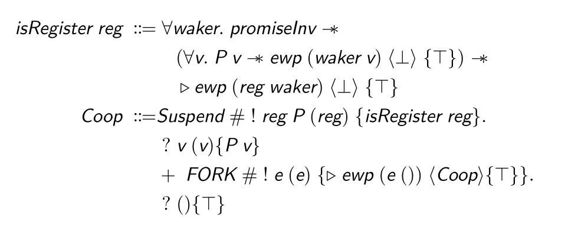

\newpage

# Table of Contents

1. Introduction
1. Verifying the Eio Scheduler
1. Verifying Eio's Customized CQS
1. Extending the Scheduler with Thread-Local variables
1. Evaluation
1. Conclusion
1. Appendix

\newpage

# 1. Introduction (WIP)

- As a motivation for the work: program verification, **safety** and why we care about it.
- Iris is a new separation logic which allows proving safety for programs using mutable shared state.
- Many programs nowadays user user-level concurrency to handle a big number of tasks. As an example for OCaml 5 there exists the Eio library which provides concurrency primitives using effect handlers.
- Effect handlers are a versatile concept which allow a modular treatment of effects, the implementation in form of a handler is separated from the code using the effect, and it's more lightweight than monads. Give a simple example of state. 
  - The biggest upside is that they are more composable than monads which often require rewriting of parts of the program into monadic style
  - In theory effect can be tracked by the type system, although OCaml 5 does not do that yet. 
  - Explain the concept of **effect safety** here.
  - Mention that continuations can only be invoked once? (not really necessary info)
- We want to verify some parts of the Eio library but the standard Heaplang language for Iris does not support effect handlers.
  - Hazel is an Iris language formalizing effect handlers using protocols.
  - Syntax and semantics of protocols.
  - Since OCaml 5 allows both effect handlers and mutable shared state we had to add a multi-threaded semantics to Hazel.
- Inherent part of a scheduler is liveness, because it is responsible for running all fibers to completion. Unfortunately it is hard to prove liveness properties in Iris so we just focus on safety and effect safety.

## 1.1. The Eio Library (WIP)
- Library for cooperative concurrency in OCaml 5.
- Implements switching between tasks using effect handlers.
- A fiber is a normal OCaml function which may perform effects that are handled by a scheduler.
- Each scheduler is only responsible for a single thread, more can be spawned.
- It offers abstractions to operating system resources to fibers, e.g. network, filesystem, timers etc. 
- It also offers synchronization and message pasing constructs like mutexes & channels which are specialized to handle fibers, i.e. a mutex does not suspend the system-level thread, but the fiber.
 
## 1.2. Focus and Structure of the Thesis

Eio aims to be the standard cooperative concurrency library for OCaml 5 so it includes many functions for structured concurrency of fibers (e.g. `Fiber.{first, any, both, all}` which run two or more fibers and combine their results), support for cancelling fibers, abstractions for operating system resources, a different scheduler implementation per OS, and synchronization constructs like promises and mutexes.
But for this work we restrict ourselves to verifying the safety and effect safety of Eio's core functionalities: 
1. Running fibers in a "common denominator" scheduler that does not interact with any OS resources,
2. awaiting the result of other fibers using the *promise* synchronization construct,
3. and spawning new schedulers to run fibers in another thread.

Below we show the simplified module hierarchy of the concepts we focus on.


Fibers can fork off new fibers using the `Fork` effect and suspend execution using the `Suspend` effect, which are both handled by the scheduler. 
This is all discussed in [ref, section 2.2].
Promises are built on top of a *CQS* datastructure, which is a kind of lock-free condition variable that is used by fibers to suspend execution until a promise is fulfilled. 
The specification of promises is discussed in [ref, section 2.3].
The CQS specification is already verified using Iris, but Eio uses a custom implementation for which we had to adapt the proof and we discuss this process in [ref, section 3].
Fibers in Eio also have access to *thread-local variables* by performing an effect, which is discussed in [ref, section 4].
They are thread-local in the sense that they are shared between all fibers of one scheduler.
Finally, we discuss our addition of multi-threading to the Hazel operational semantics in order to model running schedulers in different threads.
This turned out to be technically trivial so we only discuss it in the appendix and take a multi-threaded semantics and support for Iris' *shared invariants* as a given.

## 1.3. Contributions

To summarize our contributions, in this thesis we verify the **safety** and **effect safety** of a simplified model of Eio which serves as an extended case study on the viability of Hazel for verifying programs with effect handlers.
This includes:

- The verification of the basic Eio fiber abstraction running on a common denominator scheduler.
- An adaptation of the existing verification of CQS to the customized version used by Eio.
- Adding multi-threading to Hazel's operational semantics, which shows we can reason about programs with multi-threading & effect handlers.

# 2. Verifying a Simplified Eio Scheduler

[TODO mention that all code examples are an OCaml rendering of the verified Hazel code, based on but not equal to the Eio code]

Cooperative concurrency schedulers are commonly treated in the literature on effect handlers [ref, Paulos dissertation, Dolan paper, Daan Leijen paper] because they are a lucid example for the usefulness of handling delimited continuations in this way. 
Generally, the scheduler contains an effect handler and a fiber is just a normal function.
The fiber can yield execution by performing an effect, jumping to the effect handler (i.e. the scheduler) and providing it with the rest of the fiber's computation in the form of a continuation. 
The scheduler has a collection of continuations and by invoking one of them it schedules the next fiber.
This approach is also used in Eio.

We can therefore use the simple cooperative concurrency scheduler case study from the dissertation of de Vilhena [ref] as a starting point for our verification work.
In the following section we discuss the implementation of the simplified Eio model in more detail.
Using the implementation we give an intution about what specifications the functions should satisfy and what kind of logical state is needed to prove these specifications. 
On this intuition we will then build a formalization in [ref, section 2.2].
<!-- But some key differences in the implementation of Eio allow simplifications of the logical state that we use in our proofs. -->

## 2.1. Implementation

Let us first get an idea of how different components of the core Eio fiber abstraction interact by looking at their types.
`Scheduler.run` is the main entrypoint to Eio and it is provided a function which represents the first fiber to be executed.
The scheduler runs the main fiber and all forked-off fibers in a single thread. 
However, a fiber can also spawn new schedulers in separate threads to run other fibers in parallel as explained in [ref, appendix]
`Fiber.fork_promise` is also provided a function which represents a fiber, but this one will be forked in the current scheduler so that it runs concurrenctly. 
It returns a promise holding the eventual return value of the new fiber.
The promise is thread-safe so that also fibers running in different threads can use the `Promise.await` function to wait until the value is available.
Common problems like deadlocks are not prevented in any way and are the responsibility of the programmer.
<!-- The function sends the fiber to the scheduler by performing an effect, so it must always be called from a fiber itself. -->


```ocaml 
Scheduler.run : (() -> 'a) -> 'a option\footnote{The scheduler's result is optional because the main fiber might deadlock.}
Fiber.fork_promise : (() -> 'a) -> 'a Promise.t
Promise.await : 'a Promise.t -> 'a
```

We present code examples in a pseudo-OCaml 5 syntax because the concrete syntax of effect handlers is verbose. 
Instead, we use an overloading of the match syntax that is common in the literature which includes cases for handled effects.

```ocaml
(* declares an effect E that carries a value of type int and has a bool return value. *)
effect E : int -> bool

(* Matches on the expression e and evaluates the second branch if it performs the effect E. 
   The continuation k captures the rest of the computation of e.
   It acts as a deep handler, i.e. even if evaluating e performs E more than once the second branch will be evaluated every time. *)
match e with
| v -> ...
| effect (E v) k -> ...
```

#### `Scheduler.run`

As mentioned above this is the main entry point to the Eio library. 
It receives the main fiber as an argument and sets up the scheduler environment. 

The `run_queue` contains closures that will immediately invoke the continuation of an effect. 
This represents ready fibers which can continue execution from the point where they performed an effect.

The `next` function pops one fiber (i.e. function) from the `run_queue` and executes it.
If no more ready fibers remain -- either because all fibers terminated or there is a deadlock -- the next function just returns and the scheduler exits.

The inner `execute` function is called once on each fiber to execute it and handle any performed effects.
The return value of a fiber given to the `execute` function is always just unit.
- The main fiber is wrapped in a closure that saves its return value in a reference and returns unit so that `execute` does not need to differentiate between the main fiber and any other fiber.
- All other fibers are forked using `Fiber.fork_promise`, which also wraps them in a closure that saves their return value in a promise and returns unit.

This emphasizes the fact that an Eio scheduler is only used for running fibers. 
The interaction between fibers waiting for values of other fibers is handled separately in promises.

Handling a `Fork` effect is simple because it just carries a new fiber to be executed so the handler recursively calls the `execute` function to execute it immediately.
The execution of the original fiber is paused due to performing an effect and its continuation `k` is placed in the run queue so that it can be scheduled again.
This prioritizes the execution of a new fiber and is a design decision by Eio. 
It would be equally valid to place the `fiber` argument in the run queue.

Handling a `Suspend` effect may look complicated at first due to the higher-order `register` function.
This effect is used by fibers to suspend execution until some condition is met.
The fiber defines this condition by constructing a `register` function that in turn receives a wakeup capability by the scheduler in form of the `waker` function.
The key point is that as long as the continuation `k` is not invoked, the fiber will not continue execution.
So the `waker` function wakes up a fiber by placing its continuation into the run queue.
The `register` function is called by the scheduler right after the fiber suspends execution and can then install `waker` as a callback at a suitable place (or even call it directly).
For example, to implement promises, the `waker` function is installed in a datastructure that will call the function after the promise is fulfilled.

Note that the `waker` function's argument `v` has a *locally abstract type*, which is a typical pattern in effect handlers.
From the point of view of the fiber, the polymorphic type of the `Suspend` effect is instanitated depending on how the effect's return value is used.
But the scheduler does not get any information about this so the argument type of the continuation `k` and the `waker` function is still abstract.

Waking up should be possible across thread boundaries, which is why the run queue in Eio needs to be thread-safe.
For the verification we assume the specification of a suitable `Queue` module that supports thread-safe push and pop operations.

<!-- In our simplified model of Eio, the `Suspend` effect is only performed in the implementation of `Promise.await` which registers the `waker` callback to be called when the promise is fulfilled. -->

```ocaml
effect Fork : (() -> 'a) -> ()
type 'a waker : 'a -> ()
effect Suspend : ('a waker -> ()) -> 'a

let run (main : () -> 'a) : option 'a =
  let run_queue = Queue.create () in
  let next () = 
    match Queue.pop run_queue with
    | None -> ()
    | Some cont -> cont ()
  let rec execute fiber =
    match fiber () with
    | () -> next ()
    | effect (Fork fiber) k -> 
        Queue.push run_queue (fun () -> invoke k ());
        execute fiber
    | effect (Suspend register) k =>
      let waker = fun v -> Queue.push run_queue (fun () -> invoke k v) in
        register waker;
        next ()
  in
  let result = ref None in
  execute (fun () -> result := main ());
  !result

Caption: `Scheduler` module.
```

#### `Fiber.fork_promise`

This is the basic way to create a new fiber in Eio and the only one we model in our case study.
It will create a promise and spawn the provided function as a new fiber using the `Fork` effect.
When `f` is reduced to a value `result`, it will fulfill the promise with that value and signal all fibers waiting for that result to wake up.
The major difference to the implementation of de Vilhena is that promises in Eio are entirely handled by the fiber, and not in the effect handler code of the scheduler. 
This achieves a better separation of concerns and simplifies the logical state needed for the proof.

```ocaml
let fork_promise (f : () -> 'a) : 'a Promise.t =
  let p = Promise.create () in
  let fiber = fun () ->
    let result = f () in
    match Atomic.get p with
    | Done _ -> error "impossible"
    | Waiting cqs ->
        Atomic.set p (Done result);
        CQS.signal_all cqs 
  in
  perform (Fork fiber) 
  p

Caption: `Fiber` module
```

#### `Promise.await`

This is the most complicated looking function in our case study which is partly due to the `Suspend` effect and also due to the use of CQS functions.
The purpose of `Promise.await p` is to suspend execution of the calling fiber until `p` is fulfilled and then return its value. 
The "suspend execution" part is handled by performing the `Suspend` effect.
Then, the "until `p` is fulfilled" part is implemented by using CQS [ref, paper] functions as described in the following.

CQS is an implementation of the observer pattern and functionally similar to condition variables\footnote{\url{https://en.cppreference.com/w/cpp/thread/condition_variable}} in languages like C++ (as defined by the POSIX standard), allowing fibers to register callbacks that will be called when a condition is signalled.
The difference is that traditional condition variables are always used together with a mutex to enable synchronization between different threads, while CQS is a lock-free datastructure implementing a similar API.

Below we show the public API of the CQS module. The implementation and specification will be exapanded upon in section [ref, CQS chapter].
```ocaml
type callback = () -> ()
type register_handle

val create : () -> t
val register : t -> callback -> register_handle option
val try_cancel : register_handle -> bool
val signal_all : t -> ()

Caption: CQS module
```

In the `Promise.await` function if the promise is not fulfilled initially the fiber should wait until that is the case so it registers the `waker` function with CQS by using `CQS.register`.
In turn, the `Fiber.fork_promise` function is reponsible for fulfilling the promise and it uses `CQS.signal_all` to call all `waker` functions registered with CQS.
Recall that calling a `waker` function will enqueue the fiber that performed the `Suspend` effect in the scheduler's run queue so that it can continue execution.
In the default case the following simplified chain of events is established:
0. The fiber suspends execution at the point of evaluating `perform (Suspend register);`.
1. The `waker` function is registed with CQS.
2. The promise is fulfilled.
3. The `waker` function is called.
4. The fiber resumes execution at the point of evaluating `perform (Suspend register);`.
Therefore, after the `Suspend` effect returns we know the state of the promise is `Done` and the final value can be returned.

But because CQS is lock-free and promises can be shared between different threads there are a number of possible interleavings that the `register` function must take care of aswell.
The definition of the register function is interesting enough that we split it out into `make_register` and give a separate specification, even though it is not part of the public API of the module.
First, there could be a race on the state of the promise itself.
Right after the state is read in line 19 another thread might change the state to `Done` and go on to call `CQS.signal_all`.
If that happes there is another race between the `CQS.register` in line 7 and the `CQS.signal_all` in the other thread.
If `CQS.register` notices that there is a racing `CQS.signal_all` it will directly call the `waker`\footnote{TODO mention that this is just an optimization.}.
Otherwise, the `waker` is registered but in fact the `CQS.signal_all` might have already finished before `CQS.register` even started.
In this case the `waker` would be "lost" in the CQS, never to be called.
To avoid this, `register` must check the state of the promise again in line 12, and if it is fulfilled try to cancel the `waker` registration.
The cancel will fail if the `waker` function was already called.
If it succeeds the `register` function has the responsibility of calling `waker` itself.

```ocaml
type 'a t = Done of 'a | Waiting of CQS.t

let create () : 'a t = 
  let cqs = CQS.create () in
  Atomic.create (Waiting cqs)

let make_register (p: 'a t) (cqs: CQS.t) : (() waker -> ()) = fun waker ->
  let register_result = CQS.register cqs waker in
  match register_result with
  | None -> ()
  | Some register_handle ->
      match Atomic.get p with
      | Done result ->  
          if CQS.try_cancel register_handle
          then waker ()
          else ()
      | Waiting _ -> ()

let await (p: 'a t) : 'a = 
  match Atomic.get p with
  | Done result -> result
  | Waiting cqs ->
      let register = make_register p cqs
      perform (Suspend register);
      match Atomic.get p with
      | Done result -> result 
      | Waiting _ -> error "impossible"

Caption: `Promise` module.
```

The only **safety** concerns in the above implementation are `Fiber.fork_promise` expecting the promise to be unfulfilled and `Promise.await` expecting the promise to be fulfilled in the last match.
In both cases, the program would crash (signified by the `error` expression) if the expectation is violated. 
So to establish the safety of Eio we wish to prove that the expectations always hold and the two `error` expressions are never reached.
In the next section we show how the first situation is addressed by defining a unique resource that is needed to fulfill a promise, and the latter is a consequence of the protocol of the `Suspend` effect.

## 2.2. Specifications

To prove specifications for an effectful program in Hazel we have to define not only ghost state constructs to track program state as usual but also protocols which describe the behavior of the program's effects.
To use them in our Eio case study we adapt both the ghost state and the effect protocols from the simple cooperative concurrency scheduler case study from de Vilhena's dissertation [ref, section of Paulos paper].

#### Protocols

First we look at the protocols for the `Fork` and `Suspend` effect.
In Hazels' protocol syntax they are formalized in the following way, where the precondition of `Suspend` is given the name `isRegister` to describe the behavior of the fiber-defined `register` function.



The `Fork` effect stays almost the same compared to de Vilhena's case study.
It accepts an arbitraty expression `e` which represents the computation that a new fiber executes.
To perform the effect one must prove that `e` acts as a function that can be called on `()` and obeys the `Coop` protocol itself. 
This means spawned off fibers can again perform `Fork` and `Suspend` effects.
The *ewp* is guarded behind a later modality because of the recursive occurrence of the Coop protocol.
Since promise handling is done entirely in the fibers and the effect just hands off the fiber to the scheduler, the protocol is simplified in two ways compared to the original.
First, the scheduler does not interact with the return value of the fiber so the *ewp* has a trivial postcondition.
Second, because the scheduler does not create the promise, the protocol itself also has a trivial postcondition. 

The protocol for `Suspend` is entirely new.
From the type of the `Suspend` effect we already know that some value can be transmitted from the party that calls the `waker` function to the fiber that performed the effect.
The protocol now expresses the same idea on the level of resources. 
To suspend, a fiber must supply a function `register` that satisfies the `isRegister` predicate. 
This predicate says that `register` must be callable on a `waker` function and in turn gets to assume that the `waker` function is callable on an arbitrary value `v`, which satisfies the predicate `P`. 
Both must not perform effects.
The predicate `P` appears twice in the definition of the protocol, once in the precondition of `waker` and then in the postcondition of the whole protocol. 
It signifies the resources that are transmitted from the party that calls the `waker` function to the fiber that performed the effect.

By appropriately instantiating `P`, we can enforce that some condition holds before the fiber can be signalled to continue execution and we get to assume the resources `P v` for the rest of the execution.
For example, in the `Promise.await` specification below, we ensure that the promise must be fulfilled before the effect returns by instantiating `P` with a resource that says the promise is fulfilled.

#### Logical State

The most basic ghost state we track is wether a promise is fulfilled or not.
The `promise_waiting γ` resource exists as two halves, one owned by the fiber and one by the invariant that tracks all promises.
Both halves are combined when fulfilling the promise, yielding the persistent `promise_done γ` resource.
It is not possible to have both a `promise_waiting γ` and a `promise_done γ`.

```coq
(* TODO convert to latex *)
Definition promiseInv : iProp Σ := (
  ∃ M, isPromiseMap M ∗
    ([∗ map] args ↦ Φ ∈ M, let '(p, γ) := args in
      (∃ result,
        p ↦ Done result ∗ 
        promise_done γ ∗
        □ Φ result)
    ∨
      (∃ cqs,
        p ↦ Waiting cqs ∗
        is_cqs cqs ∗
        promise_waiting γ ∗
        resume_all_permit))
)%I.

Definition ready (k: val) : iProp Σ := (
  EWP (k #()) <| ⊥ |> {{ _, ⊤ }}
)%I.
```

*PromiseInv* still tracks the state of all existing promises, which are either *Done* or *Waiting*.
As long as the promise is not fulfilled, it holds an instance of CQS so that wakers can be registered along with a `resume_all_permit`. 
This token is used to call the `CQS.signal_all` function which must only be called once.
When the promise is fulfilled it instead holds a final value `v` satisfying some predicate `Φ`.

The *Ready* predicate now just expresses that *k* is safe to be executed. 
Compared to de Vilhena's formalization, the *Φ(v)* predicate was dropped because the scheduler does not interact with the return value of an effect; this has moved to the protocol of `Suspend` as *P(v)*.
We were able to drop the other preconditions because they are now put into Iris shareable invariants since Eio supports multi-threading.
Now *Ready* is neither recursive nor mutually recursive with *isPromise* anymore, which simplifies its usage in Iris.

#### `Scheduler.run`

The interesting part about the scheduler specification is that it proves **effect safety** of the runtime, i.e. no matter what a fiber does it will not crash the scheduler due to an unhandled effect.
However, the specification only talks about effect safety and not about handling fibers correctly in any other way, e.g. regarding fairness of scheduling or just not dropping fibers. 
For example, a trivial function which ignores the `main` argument and immediately returns satisfies the same specificaiton.
For a scheduler it would be desirable to prove these properties, too, but since they are liveness properties it is hard to do in Iris and not a focus of this thesis.

```coq
Lemma ewp_run (main : val) :
  EWP main #() <| Coop |> {{ ⊤ }} -∗
    EWP run main <| ⊥ |> {{ ⊤ }}.
```

The proof proceeds as follows:
- Creating the run queue also returns a persistent resource which is used for all later calls to the `next` function.
- For the inner `fork` function we use Löb induction since it is called recursively. 
- Since it is a deep effect handler we need to satisfy the `deep-handler` predicate for the `Coop` protocol.
  - The `Fork` case just recurses in the `fork` function so we use the induction hypothesis.
  - For the `Suspend` case we define the `waker` function and prove `P v -∗ EWP waker () <| ⊥ |> {{ ⊤ }}` in order to call the `register` function on it. This holds by construction of the `waker` function because `P v` is a precondition for invoking the fiber's continuation `k`.

#### `Fiber.fork_promise`

For this specification, the *PromiseInv* argument is needed to interact with promises and the *ewp* proves that the new fiber is safe to execute and obeys the `Coop` protocol.
In return, the caller gets a promise that will eventually hold a value satisfying the predicate `Φ`.

```coq
Lemma ewp_fork_promise (f: val) Φ :
  promiseInv ∗ EWP f #() <| Coop |> {{v, □ Φ v}}
⊢ 
  EWP (fork_promise f) <| Coop |> {{ y, 
    ∃ (p: loc), ⌜ y = #p ⌝ ∗ isPromise p Φ}}.
```

The proof proceeds as follows:
- First, a new promise is created, which updates the *PromiseInv* invariant and yields one half of the `promise_waiting γ` resource for that new promise.
- We define the actual fiber and prove its *ewp*.
  - Evaluating `f` yields a value satisfying `Φ` as given by the *ewp*.
  - Because we own `promise_waiting γ` the second branch of the match can be ruled out. Now the *PromiseInv* invariant is accessed to update the promise state to `Done`. This consumes both halves of the `promise_waiting γ` resource and yields a `promise_done γ`. We also take out the `resume_all_permit`.
  - We use this permit along with `promise_done γ` to call `CQS.resume_all`. `promise_done γ` is persistent so it can be used to call all wakers.
- Using the *ewp* for the wrapped `f` we can perform a `Fork` effect.
- Since the promise will be fulfilled with a value satisfying `Φ` we have the `isPromise p Φ` that we must return.

#### `Promise.await`

The `register` function which is passed to the `Suspend` effect is complex enough that we spin out its specification.
The implementation of `Promise.await` is very different from the original but still satisfies the same specification. *PromiseInv* and *IsPromise* are both needed to interact with the promise's state.

```coq
Lemma ewp_await_make_register (p: loc) (cqs: val) Φ:
  isPromise p Φ ∗ is_cqs cqs 
⊢
  EWP (make_register #p cqs) <| ⊥ |> {{register, 
    ∀ (waker: val), (promise_done γ -∗ EWP waker #() <| ⊥ |> {{ ⊤ }}) -∗
    promiseInv -∗ 
      ▷ EWP register waker <| ⊥ |> {{ ⊤ }} }}.

Lemma ewp_await (p: loc) Φ :
  promiseInv ∗ isPromise p Φ ⊢ 
    EWP await #p <| Coop |> {{v, □ Φ v}}.
```

The proof of the `Promise.await` specification proceeds as follows:
- For the first match on the promise state we don't have any resources to constrain the possible results.
- If the promise is already fulfilled we can take the `Φ v` and return that.
- If it is not fulfilled, then we get access to a CQS instance and can make the `register` function using the *IsPromise* and `is_cqs` resources.
- Using the *ewp* for the `register` function we can invoke the `Suspend` effect and set `P _ := promise_done γ`.
- As a result we now have the `promise_done γ` resource and when we match on the promise again, the unfulfilled case can be ruled out.
- So now we can take the `Φ v` and return it.

The proof of the `make_register` specification follows directly from the specifications of the CQS functions, which are explained in further detail in the next chapter.

<!-- We recall that when awaiting a promise, a fiber first checks if the promise is already fulfilled by atomically loading its state.
If it is not fulfilled, the fiber then performs a `Suspend` effect and starts a suspend operation, providing the `waker` of the `Suspend` effect as the handle.
The suspend operation might fail because the promise could have been fulfilled concurrently.
Since the promise could have been fulfilled in the meantime, the fiber must then again atomically load the state of the promise.

- If it has not been fulfilled the fiber does not need to do anything because it will eventually be woken up by a resume all operation invoking the `waker`.
- But if the promise has been fulfilled the fiber must attempt to cancel the suspend operation.
  That is because in this situation the suspend operation races with a concurrent resume all operation, which might already have invoked all `waker`s **before** this fiber was able to save its `waker` in the broadcast.
  In this case the `waker` would be lost and the fiber never resumes execution.
  If the `waker` has not been invoked yet (either because resume all has not arrived at this waker or it arrived before the waker was saved in the broadcast) the cancellation attempt succeeds and the fiber invokes its own `waker`.
  Otherwise we know that the `waker` has already been invoked, so the fiber does not need to do anything.

This complicated interplay between two fibers is due to CQS being lock-free but it ensures that fibers only resume execution when the promise is fulfilled and that all `waker`s will be eventually called. -->

<!-- ```
Aside: All wakers are eventually called.
This statement is purely based on a reading of the code. It might be possible to formally prove this with an approach
like Iron [ref] or Transfinite Iris [ref] because it is a liveness property.
But for the Iron approach it is unclear to us how to formulate the linearity property.
``` -->

# 3. Verifying Eio's Customized CQS (WIP)

<!-- In general, what is CQS? -->

CQS [ref, paper] (for CancellableQueueSynchronizer) is an implementation of a synchronization primitive that allows execution contexts to wait until signalled.
Its specification is already formally verified in Iris, which we adapted to use in our case study.
The nature of a CQS execution context is kept abstract but it is assumed that they support stopping execution and resuming with some value.
This is because CQS is designed to be used in the implementation of other synchronization constructs (e.g. mutex, barrier, promise, etc.) which take care of actually suspending and resuming execution contexts as required by their semantics.

<!-- How does Eio use CQS?  -->

In the case of Eio an "execution context" is an Eio fiber but nevertheless CQS works across multiple threads, so fibers can use CQS to synchronize with fibers running in another thread.
Eio implements a custom version of CQS adapted from the paper [ref, paper] in the `Broadcast` module, which in turn is used in the implementation of the _promise_ synchronization construct.
In this chapter we describe the behavior of Eio's _customized CQS_, highlight differences to the _original CQS_, and explain how we adapted the verification of the original CQS for our case study.
If something applies to both the customized and original version we just use the term _CQS_.
After having presented the adapted specification for the `Broadcast` module we can then explain the implementation of the `Promise` module which we kept abstract in section 1.

## Operations of CQS

<!-- What are the operations supported by the original CQS. -->

The original CQS supports three operations that are interesting to us.
In a _suspend operation_ the requesting execution context wants to wait until signalled.
It places a handle to itself in the datastructure and is expected to stop execution afterwards.
But before it actually stops execution it can use the _cancel operation_ to try to cancel the _suspend operation_.
Finally, a _resume operation_ can be initiated from a different execution context.
It takes one handle out of the datastructure and uses it to signal the original execution context that it can resume execution.
This fails if the _suspend operation_ (and thereby the handle) had already been cancelled.

<!-- Which operations does Eio add? -->

These operations enable a single execution context to wait until it is signalled by another.
Eio's customized CQS supports an additional operation called the _resume-all operation_.
As the name implies, it is a _resume operation_ that applies to all currently saved handles.
This operation was added so that **all** fibers waiting on a promise can be signalled when the promise is fulfilled.

<!-- How to understand the operations?  -->

To understand the operations it is helpful to view them in the context of their Eio implementation.
Here, what we called the "handle" to an execution context is the `waker` callback resulting from a fiber performing a `Suspend` operation.
We recall that if the `waker` callback is invoked, its fiber is placed into the scheduler's run queue and will therefore resume execution.
We show the operations' OCaml types and also how the operations are used in the outer synchronization construct (i.e. an Eio _promise_).

<!-- How are the operations used? -->

An interaction with CQS as described in [ref, paper] is always guarded by first accessing some atomic variable.
In the case of Eio, the atomic variable holds the state of the promise, which can either be `Unfulfilled cqs` -- holding a customized CQS instance -- or `Fulfilled v` -- holding the final value `v` of the associated fiber.

- If the promise is already fulfilled with a value, a requesting fiber immediately returns that value.
- If the promise is not yet fulfilled, a requesting fiber will perform a `Suspend` effect in order to stop execution and use the _suspend operation_ to wait until the promise is fulfilled.
- Optionally, it can also use the _cancel operation_ afterwards.
- The fiber that is associated with the promise will fulfill it with a value and then use the _resume-all operation_ to signal all waiting fibers that they can now retrieve the value.


It is important to note that since CQS is lock-free and fibers can run on different threads there can be a race between concurrent _suspend_, _cancel_ and _resume-all operations_.
Possible interleavings and the necessity of the _cancel operation_ are explained in section [ref, Promise Implementation].
This example illustrates that a CQS instance always acts as a thread-safe store for cancellable callbacks.
More precisely, it is a FIFO queue but a _resume-all operation_ dequeues all elements at once.

<!-- What are the types of the operations. -->

That CQS is "just" a store for cancellable callbacks is also reflected in the rather barebones types of the operations as implemented in OCaml.
A CQS instance can be `create`d and shared between different threads.
New callbacks are inserted using the `suspend` function, yielding an optional `request` value.
If `suspend` returns `None` the callback has already been invoked due to a concurrent `resume_all`.
A `request` value can then be used to cancel the insertion, signifying that a fiber can only cancel its own callback.
The `resume_all` function (logically) consumes the CQS, which will become more clear when we present the specifications in [ref, Verification of the `Broadcast` module]

```ocaml
type t
type request

val create : unit -> t
val suspend : t -> (unit -> unit) -> request option
val cancel : request -> bool
val resume_all : t -> unit
```

## Implementation and Logical Interface of CQS

<!-- Some general information how CQS is implemented and the logical state describing the entire queue. -->

CQS is implemented as a queue of _cells_ with two pointers pointing to the beginning and end of the active cell range, the _suspend pointer_ and the _resume pointer_.
Cells not reachable from either pointer are garbage collected but their logical state is still tracked.
There is a stack of operations for manipulating these pointers to implement the higher-level functionality but they are not part of the public API so we do not focus on them.
Each cell is a container for one handle and the logical state of the queue tracks the logical state of all existing cells shown in figure [ref, below].

The number of active cells `n` (i.e. the length of the queue) is tracked by the logical resource `cqs_state n`.
In normal usage of CQS, the atomic variable of the outer synchronization construct would encode the length of the queue in its value and keep this resource in an associated invariant.
Logically changing the length of the queue is done using _enqueue_ and _dequeue registration_ operations when opening this invariant.

As we saw before, however, for promises the exact length of the queue is irrelevant because the _resume-all operation_ will always set the length to 0.
So in the adapted proof we keep the `cqs_state n` resource in the invariant of CQS itself.
As a consequence we also move the _enqueue_ and _dequeue registration_ out of the public API because they are now done internally.

## Verification of the `Broadcast` Module

In the following we describe the specifications we proved for the three operations `suspend`, `cancel` and `resume_all` of Eio's `Broadcast` module, in which points they differ from the specifications of the original CQS operations, and what changes we did to the internal logical state of CQS to carry out the proofs.

<!-- Futures vs. Callbacks -->

The first major change was replacing the future-based interface of the suspend operation with a callback-based interface.
In the original CQS, performing a suspend operation returns a new future, which is also inserted as the handle into the queue.
The execution context can then use the future to stop execution because it is assumed there is a runtime that allows suspending execution until the completion of a future.
But Eio cannot use this interface because it uses the customized CQS to _build_ the runtime that allows fibers to suspend until the completion of a promise.
As explained above, Eio implements CQS with a callback-based interface where the fiber performing the suspend operation passes in a callback as the handle and afterwards implicitly stops execution.
Performing a resume operation analogously invokes the callback, instead of completing the future.

This changes the logical state of CQS only slightly.
The original CQS tracked the state of the future for each cell and managed _futureCancellation_ and _futureCompletion_ tokens.
In the customized CQS we analogously track the state of the callback for each cell and manage _callbackInvokation_ and _callbackCancellation_ tokens.

For all three operations, the Eio implementation differs from the implementation already verified in the original CQS (i.e. some reordered instructions or a slightly different control flow) and they have different specifications as discussed below.
However, the specifications of the underlying operations for manipulating the cell pointers are modular enough to allow us to prove the new specifications for `suspend` and `cancel`.
Note that the presented specifications are cleaned up for readability.

```
Aside: Implementation of resume_all
Eio implements resume_all by atomically increasing the *resume pointer* by some number n, instead of just 1 like in the original resume.
Because of technical differences between the infinte array implementation in the CQS mechanization & the infinite array implementation of Eio did not yet verify Eio's custom resume_all function.
Instead, I actually defined resume_all simply as a loop over a resume operation.
Since resume_all is only called once I posit that this verification is still valid but I still want to verify Eio's resume_all and remove this aside.
```

The logical state of an individual cell is changed by the functions according to the following diagram.


#### `create`

Creating a CQS instance requires `inv_heap_inv` which is an Iris propositions that we are in a garbage-collected setting.
It creates an `is_cqs γ q` which is a persistent resource that shows the value `q` is a CQS queue, along with a collection of ghost names we summarize with `γ`.
The resource `cqs_state n` mentioned above is now kept inside `is_cqs γ q`.
It also returns the unique resource `resume_all_permit γ`, which is held by the enclosing promise and allows calling the `resume_all` function once.

```coq
Theorem create_spec:
  {{{ inv_heap_inv }}}
    newThreadQueue #()
  {{{ γ q, RET q; is_cqs γ q ∗ resume_all_permit γ }}}.
```

#### `suspend`

For a _suspend operation_ the _suspend permit_ from the original CQS is not needed anymore since we do the _enqueue registration_ internally.
The `is_waker` resource is defined as `V' -∗ EWP k () {{ ⊤ }}` and represents the permission to invoke the callback `k`.
We instantiate `V'` with `promise_state_done γp` so that the callback transports the knowledge that the promise has been fulfilled.
`is_waker` is not persistent because the callback must be invoked only once and it might be accessed from a different thread.

The `suspend` function will advance the _suspend pointer_ to allocate a new cell in the **EMPTY** logical state.
If there is a concurrent call to `resume_all` which changed the cell to the **RESUMED** logical state before this function can `CAS` the callback into the cell, the callback is invoked immediately and `NONEV` is returned.
In this case, the state of the cell will be set to **TAKEN**.
Otherwise the callback is saved in the cell, which is advanced to the **CALLBACK(waiting)** logical state and a `is_suspend_result` resource is returned as the cancellation permit.

```coq
Theorem suspend_spec γ q k:
  {{{ is_cqs γ q ∗
      is_waker V' k }}}
    suspend q k
  {{{ v, RET v; ⌜v = NONEV⌝ ∨
                ∃ γk r, ⌜v = SOMEV r⌝ ∗
                         is_suspend_result γ γk r k }}}.
```

#### `cancel`

The specification of the _cancel operation_ is a lot simplified compared to the original due to removed features.
The `is_suspend_result` resource is used as a permission token and the `r` value is used to find the callback that should be cancelled.

If the callback had already been invoked by a concurrent call to `resume_all` (i.e. the logical state is **CALLBACK(resumed)**) the function returns `false` and no resources are returned to the caller.
Otherwise, the permission to invoke the callback is returned and the cell is advanced to the **CALLBACK(cancelled)** logical state.

```coq
Theorem try_cancel_spec γ q γk r k:
  {{{ is_cqs γ q ∗
      is_suspend_result γ γk r k }}}
    cancel r
  {{{ (b: bool), RET #b; if b then is_waker V' k
                         else True }}}.
```

#### `resume_all`

The specification of the _resume-all operation_ is also a lot simplified compared to the specification of the original _resume operation_ because we removed multiple unused features.
The `resume_all_permit` is a unique resource used to ensure the function can only be called once.
The `V'` resource must be duplicable because it will be used to invoke multiple callbacks, which have `V'` as their precondition.
It does not return any resources because its only effect is making an unknown number of fibers resume execution, which is not something we can easily formalize in Iris.

```coq
Theorem resume_all_spec γ q:
  {{{ is_thread_queue γ q ∗
      □ V' ∗
      resume_all_permit γ }}}
    resume_all q
  {{{ RET #(); True }}}.
```

## Features Removed from Original CQS

The original CQS supports multiple additional features like a synchronous mode for suspend and resume, and also a smart cancellation mode.
These features enlarge the state space of CQS and complicate the verification but are not used in Eio so when we ported the verification of CQS to our Eio case study we removed support for these features.
This reduced the state space of a cell shown below (taken from the original paper) to something more manageable for us when adapting the proofs.


Due to this, the part of the verification of the original CQS that we had to customize for Eio shrunk by approximately 1300 lines of Coq code from the original 3600 lines of Coq code, while there is an additional ~4000 lines of Coq code that we did not need to adapt.

# 4. Extending the Scheduler with Thread-Local Variables (WIP)

- How thread-local variables can be used.
- Explain the GetContext effect in Eio and how we model it in our scheduler.
- How we adapt our logical state to include GetContext.
  And explain that we need to parameterize the protocol to solve the issue of shared knowledge between the scheduler and fiber.

# 6. Evaluation (WIP)

# 7. Conclusion (WIP)

# Bibliography

- A Formally-Verified Framework For Fair Synchronization in Kotlin Coroutines
- A Separation Logic for Effect Handlers
- A Type System for Effect Handlers and Dynamic Labels
- Concurrent System Programming with Effect Handlers
- Structured Asynchrony with Algebraic Effects
- Retrofitting Effect Handlers onto OCaml
- Retrofitting Parallelism onto OCaml

# Appendix
## A. Translation Table

| Eio | Thesis | Mechanization |
|-|-|-|
| `enqueue` | `waker` function | `waker` |
| `f`       | register function | `register` |
| `Fiber.fork_promise` | `Fiber.fork_promise` | `fork_promise` |
| `Promise.await` | `Promise.await` | `await` |
| `Broadcast` & `Cells` | CQS | `CQS` |

## B. Towards A Multi-Threaded Scheduler

OCaml 5 added not only effect handlers but also the ability to use multiple threads of execution, which are called _domains_ (in the following we use the terms interchangeably).
Each domain in OCaml 5 corresponds to one system-level thread and the usual rules of multi-threaded execution apply, i.e. domains are preemtively scheduled and can share memory.
Eio defines an operation to make use of multi-threading by forking off a new thread and running a separate scheduler in it.
So while each Eio scheduler is only responsible for fibers in a single thread, fibers can await and communicate with fibers running in other threads.

In order for a fiber to be able to await fibers in another thread, the `wakers_queue` [note it will be in the Simple Scheduler section] from above is actually a thread-safe queue based on something called CQS, which we will discuss in detail in a later section.

Heaplang supports reasoning about multi-threaded programs by implementing fork and join operations for threads and defining atomic steps in the operational semantics, which enables the use of Iris _invariants_.
In contrast, Hazel did not define any multi-threaded operational semantics but it contained most of the building blocks for using invariants.
In the following we explain how we added a multi-threaded operational semantics and enabled the use of invariants.

```
Aside: Memory Model in OCaml 5
In the OCaml 5 memory model, *atomic variables* are needed in order to access shared memory without introducing data races.
Instead of modelling atomic variables in Hazel, we continue to use normal references because the multi-threaded operational semantics by definition defines all memory operations to be sequentially consistent. This seems to be the standard approach and is done the same way in Heaplang.
```

### Adding Invariants to Hazel

Invariants in Iris are used to share resources between threads.
They encapsulate a resource to be shared and can be opened for a single atomic step of execution.
During this step the resource can be taken out of the invariant and used in the proof but at the end of the step the invariant must be restored.

Hazel did already have the basic elements necessary to support using invariants.
It defined a ghost cell to hold invariants and proved an invariant access lemma which allows opening an invariant if the current expression is atomic.
In order to use invariant we only had to provide proofs for which evaluation steps are atomic.
We provided proofs for all primitive evaluation steps.
The proofs are the same for all steps so we just explain the one for `Load`.

```coq
Lemma ectx_language_atomic a e :
  head_atomic a e → sub_exprs_are_values e → Atomic a e.

Instance load_atomic v : Atomic StronglyAtomic (Load (Val v)).
Instance store_atomic v1 v2 : Atomic StronglyAtomic (Store (Val v1) (Val v2)).
...
```

An expression is atomic if it takes one step to a value, and if all subexpressions are already values.
The first condition follows by definition of the step relation and the second follows by case analysis of the expression.

Since performing an effect starts a chain of evaluation steps to capture the current continuation, it is not atomic.
For the same reason an effect handler and invoking a continuation are not atomic except in degenerate cases.
Therefore, invariants and effects do not interact in any interesting way.

[TODO How we add support for the iInv tactic to use invariants more easily.]

### Adding Multi-Threading to Hazel

To allow reasoning in Hazel about multi-threaded programs we need a multi-threaded operational semantics as well as specifications for the new primitive operations `Fork`, `Cmpxcgh` and `FAA`.

The language interface of Iris provides a multi-threaded operational semantics that is based on a thread-pool.
The thread-pool is a list of expressions that represents threads running in parallel.
At each step, one expressions is picked out of the pool at random and executed for one thread-local step.
Each thread-local step additionally returns a list of forked-off threads, which are then added to the pool.
This is only relevant for the `Fork` operation as all other operations naturally don't fork off threads.

```
(e, \sigma) ->_t (e', \sigma', es')
------------------------------------------------------------
(es_1 ++ e ++ es_2, \sigma) ->_mt (es_1 ++ e' ++ es_2 + es', \sigma')
```

Heaplang implements multi-threading like this and for Hazel we do the same thing.
We adapt Hazel's thread-local operational semantics to include `Fork`, `Cmpxchg` and `FAA` operations and to track forked-off threads and get a multi-threaded operational semantics "for free" from Iris' language interface.

[TODO one of the proofs that the language interface requires was a bit tricky so include that.]

Additionally, we need to prove specifications for these three operations.
`Cmpxchg` and `FAA` are standard so we will not discuss them here.
The only interesting design decision in the case of Hazel is how effects and `Fork` interact.
This decision is guided by the fact that in OCaml 5 effects never cross thread-boundaries.
An unhandled effect just terminates the current thread.
As such we must impose the empty protocol on the argument of `Fork`.

```
EWP e <| \bot |> { \top }
-------------------------------------
EWP (Fork e) <| \Phi |> { x, x = () }
```

[TODO explain how that proof works.]

Using these primitive operations we can then build the standard `CAS`, `Spawn`, and `Join` operations on top and prove their specifications.
For `Spawn` & `Join` we already need invariants as the point-to assertion for the done flag must be shared between the two threads.

```
Lemma spawn_spec (Q : val → iProp Σ) (f : val) :
  EWP (f #()) <| \bot |> {{ Q }} -∗ EWP (spawn f) {{ v, ∃ (l: loc), ⌜ v = #l ⌝ ∗ join_handle l Q }}.

Lemma join_spec (Q : val → iProp Σ) l :
  join_handle l Q -∗ EWP join #l {{ v, Q v }}.

Definition spawn_inv (γ : gname) (l : loc) (Q : val → iProp Σ) : iProp Σ :=
  ∃ lv, l ↦ lv ∗ (⌜lv = NONEV⌝ ∨
                  ∃ w, ⌜lv = SOMEV w⌝ ∗ (Q w ∨ own γ (Excl ()))).

Definition join_handle (l : loc) (Q : val → iProp Σ) : iProp Σ :=
  ∃ γ, own γ (Excl ()) ∗ inv N (spawn_inv γ l Q).
```

Note that for `Spawn` we must also impose the empty protocol on `f` as this expression will be forked-off.

This allows us to implement standard multi-threaded programs which also use effect handlers.
For example, we can prove the specification of the function below that is based on an analogous function in Eio which forks a thread and runs a new scheduler inside it.
Note that same as in Eio the function blocks until the thread has finished executing, so it should be called in separate fiber.

```
Definition spawn_scheduler : val :=
  (λ: "f",
    let: "new_scheduler" := (λ: <>, run "f") in
    let: "c" := spawn "new_scheduler" in
    join "c")%V.

Lemma spawn_scheduler_spec (Q : val -> iProp Σ) (f: val) :
  promiseInv -∗ EWP (f #()) <| Coop |> {{ _, True }} -∗
    EWP (spawn_scheduler f) {{ _, True }}.
```

The scheduler `run` and therefore also the `spawn_scheduler` function don't have interesting return values, so this part of the specification is uninteresting.
What is more interesting is that they encapsulate the possible effects the given function `f` performs.

## C. A Note on Cancellation

- That we tried to model cancellation but the feature is too permissive to give it a specification.
- There is still an interesting question of safety (fibers cannot be added to a cancelled Switch).  
  But including switches & cancellation in our model would entail too much work so we leave it for future work.
