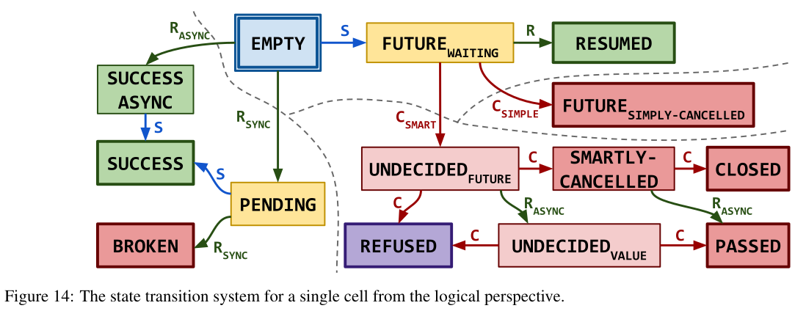

# Eio's CQS

CQS by Koval et al. is a formally verified implementation of a lock-free queue.
It is implemented by an infinite array of cells which can be in a couple of different states.
Eio uses a customized variant which is parameterized in the cell state transitions (which kinda makes it harder to reuse the proofs).

Dequeuing is also called "suspend" because it will wait until a value is ready to dequeue.
Enqueuing is also called "resume" because it will resume one other suspended thread.
CQS is built up of different layers, but we only need to care about 2.

1. The infinite array  
   
   There are two pointers into the array, for enqueuing and dequeuing.
   Both move monotonically forward.
   Each cell in the array can either be cancelled or not.
   The relevant API is:
   - findCell: move one of the pointers forward and return the pointed-to cell.
   - cancelCell: set a cell to cancelled (this is for efficiency, a segment of only cancelled cells can be deallocated)
2. The queue  
   Standard CQS has a pretty complicated cell state transition system, because there are multiple ways to logically cancel a cell (C_SIMPLE & C_SMART), and you can enqueue a value either async or sync (R_ASYNC & R_SYNC).
   
   The relevant API is:
   - suspend: pop a value from the queue
   - resume: push a value into the queue
   - cancel: logically cancel a cell using a cellPtr received from suspend

The Eio CQS impementation parameterizes the infinte array by the possible cell states, so it also changes the possible cell transitions.
Therefore, we can reuse the verification of the infinite array, but we need to define analogues of `suspend`, `resume` & `cancel` and prove specifications for them.

The fun part is that other abstractions in Eio that use CQS all use different cell state parameters, so we would have to do that for every one.
We focus first on `Broadcast` which is used for promises.

## Infinite Array Specification

- TODO why is everything parameterized by a namespace? maybe to be able to use different queues at the same time?

The specification is pretty large.
I am still trying to discern what parts are relevant.

```ocaml
  (* identifies an infinite array. persistent of course to be able to use it from different threads. *)
  is_infinite_array (N: namespace) (γ: gname)
                    (cell_is_owned: nat → iProp Σ): iProp Σ;
  is_infinite_array_persistent N γ co:
    Persistent (is_infinite_array N γ co);
  (* TODO *)
  infinite_array_mapsto (N: namespace) (cell_is_owned: nat -> iProp Σ)
                        (γ: gname) (i: nat) (ℓ: loc): iProp Σ;
  infinite_array_mapsto_persistent N co γ i ℓ:
    Persistent (infinite_array_mapsto N co γ i ℓ);
  infinite_array_mapsto_agree N co γ i ℓ ℓ':
    infinite_array_mapsto N co γ i ℓ -∗ infinite_array_mapsto N co γ i ℓ'
                          -∗ ⌜ℓ = ℓ'⌝;
  (* a pointer into the infinite array,
     p: program value
     i: logical index in the array *)
  is_infinite_array_cell_pointer N (γ: gname) (p: val) (i: nat):
      iProp Σ;
  (* TODO according to definition the cutoff reading is an index that is at the start of a segment. Would have to check how it is used. *)
  is_infinite_array_cutoff_reading (N: namespace) (γ: gname)
                                   (p: val) (start_id: nat): iProp Σ;
  is_infinite_array_cutoff_reading_persistent N γ p start_id:
    Persistent (is_infinite_array_cutoff_reading N γ p start_id);
  is_infinite_array_cell_pointer_persistent N γ p i:
    Persistent (is_infinite_array_cell_pointer N γ p i);
  is_infinite_array_cutoff
    (N: namespace) (γ: gname) (v: val)
    (start_index: nat): iProp Σ;
  (* whether a cell is cancelled *)
  cell_is_cancelled (N: namespace) (γ: gname) (i: nat): iProp Σ;
  cell_is_cancelled_persistent N γ i: Persistent (cell_is_cancelled N γ i);
  (* permission to cancel a cell *)
  cell_cancellation_handle
    (N: namespace) (γ: gname) (i: nat): iProp Σ;
  cell_cancellation_handle_exclusive N γ i:
    cell_cancellation_handle N γ i -∗ cell_cancellation_handle N γ i -∗ False;
  cell_cancellation_handle_not_cancelled N γ i:
    cell_is_cancelled N γ i -∗ cell_cancellation_handle N γ i -∗ False;
  acquire_cell N cell_is_owned E γ i ℓ:
    ↑N ⊆ E →
    infinite_array_mapsto N cell_is_owned γ i ℓ ={E, E∖↑N}=∗
    ▷ (cell_is_owned i ∨ ℓ ↦ NONEV ∗ cell_cancellation_handle N γ i) ∗
    (▷ (cell_is_owned i ∨ ℓ ↦ NONEV ∗ cell_cancellation_handle N γ i)
     ={E∖↑N, E}=∗ True);
  (* creating a new infinite array *)
  newInfiniteArray_spec N co k:
    {{{ ⌜(k > 0)%nat⌝ ∧ inv_heap_inv }}}
      newInfiniteArray impl #k
    {{{ γ ℓ, RET #ℓ; is_infinite_array N γ co ∗
                    [∗ list] i ∈ seq 0 k,
                      is_infinite_array_cutoff N γ #(ℓ +ₗ Z.of_nat i) 0
    }}};
  cancelCell_spec N γ co p i:
    is_infinite_array N γ co -∗
    is_infinite_array_cell_pointer N γ p i -∗
    <<< ▷ cell_cancellation_handle N γ i >>>
        cancelCell impl p @ ⊤ ∖ ↑N
    <<< ▷ cell_is_cancelled N γ i, RET #() >>>;
  findCell_spec N γ co p (source_id id: nat):
    {{{ is_infinite_array N γ co ∗
        is_infinite_array_cutoff_reading N γ p source_id }}}
    findCell impl p #id @ ⊤
    {{{ p' id', RET p'; is_infinite_array_cell_pointer N γ p' id'
        ∗ ⌜(id ≤ id')%nat⌝
        ∗ ∀ i, (⌜max source_id id ≤ i < id'⌝)%nat -∗
          cell_is_cancelled N γ i ∗ ∃ ℓ, infinite_array_mapsto N co γ i ℓ
    }}};
  derefCellPointer_spec N co γ (p: val) i:
    {{{ is_infinite_array N γ co ∗ is_infinite_array_cell_pointer N γ p i }}}
      derefCellPointer impl p
    {{{ ℓ, RET #ℓ; infinite_array_mapsto N co γ i ℓ }}};
  cutoffMoveForward_spec N co γ (p v: val) i:
    is_infinite_array N γ co -∗
    is_infinite_array_cell_pointer N γ p i -∗
    <<< ∀ start_index, ▷ is_infinite_array_cutoff N γ v start_index >>>
      cutoffMoveForward impl v p @ ⊤ ∖ ↑N
    <<< ∃ (success: bool), if success
        then ∃ i', ⌜start_index ≤ i' ≤ max i start_index⌝ ∧
                  is_infinite_array_cutoff N γ v i'
        else ▷ is_infinite_array_cutoff N γ v start_index, RET #success >>>;
  cutoffGetPointer_spec N γ (v: val):
    ⊢ <<< ∀ i, ▷ is_infinite_array_cutoff N γ v i >>>
      cutoffGetPointer impl v @ ⊤
    <<< ∃ (p: val), is_infinite_array_cutoff N γ v i ∗
                    is_infinite_array_cutoff_reading N γ p i, RET p >>>;
  cellPointerId_spec N co γ (p: val) i:
    {{{ is_infinite_array N γ co ∗ is_infinite_array_cell_pointer N γ p i }}}
      cellPointerId impl p
    {{{ RET #i; True }}};
  cellPointerCleanPrev_spec N co γ (p: val) i:
    {{{ is_infinite_array N γ co ∗ is_infinite_array_cell_pointer N γ p i }}}
      cellPointerCleanPrev impl p
    {{{ RET #(); True }}};
```

## (Broadcast) Queue Specification

This specification would be inspired by the original one from CQS, but it has `resume_all` instead of `resume`, which resumes all cells currently in the queue.

The original specification from CQS is the following.

- TODO to call suspend you need to give up some resource E to get the `suspension_permit`. You should get it back from calling the cancel function but I'm not sure how.
- TODO find a specification for Eio's `Broadcast`

```
Theorem suspend_spec γa γtq γe γd e d:
  {{{ is_thread_queue γa γtq γe γd e d ∗ suspension_permit γtq }}}
    suspend array_interface e
  {{{ v, RET v; ⌜v = NONEV⌝ ∧ E ∗ CB ∨
                ∃ γf v', ⌜v = SOMEV v'⌝ ∧
                         is_thread_queue_future γtq γa γf v' ∗
                         thread_queue_future_cancellation_permit γf }}}.

Lemma tryResume_spec (mayBreakCells shouldAdjust waitForResolution: bool)
      (returnRefusedValue: val) (maxWait: nat) γa γtq γe γd e d v:
  NTq ## NFuture ->
  lit_is_unboxed v ->
  shouldAdjust = negb immediateCancellation ->
  {{{ ERefuse ∗ V v }}}
    returnRefusedValue #v
  {{{ RET #(); ▷ E }}} -∗
  {{{ is_thread_queue γa γtq γe γd e d ∗ awakening_permit γtq ∗
      V v ∗ if mayBreakCells then CB else True }}}
    tryResume array_interface #maxWait #shouldAdjust #mayBreakCells #waitForResolution
      d returnRefusedValue #v
  {{{ (n: nat), RET #n; ⌜n = 0⌝ ∧ E ∗ (if mayBreakCells then CB else True) ∨
                      ⌜n = 1⌝ ∧ V v ∗ (if mayBreakCells then CB else True) ∗
                        (if immediateCancellation then R
                         else awakening_permit γtq) ∨
                      ⌜n = 2 ∧ mayBreakCells⌝ ∧ R ∗ V v
  }}}.

Lemma resume_spec (mayBreakCells shouldAdjust waitForResolution: bool)
      (returnRefusedValue: val) (maxWait: nat) γa γtq γe γd e d v:
  NTq ## NFuture ->
  lit_is_unboxed v ->
  shouldAdjust = negb immediateCancellation ->
  {{{ ERefuse ∗ V v }}}
    returnRefusedValue #v
  {{{ RET #(); ▷ E }}} -∗
  {{{ is_thread_queue γa γtq γe γd e d ∗ awakening_permit γtq ∗
      V v ∗ if mayBreakCells then CB else True }}}
    resume array_interface #maxWait #shouldAdjust #mayBreakCells #waitForResolution
      d returnRefusedValue #v
  {{{ (r: bool), RET #r; if r then E ∗ if mayBreakCells then CB else True
                      else ⌜immediateCancellation ∨ mayBreakCells⌝ ∧
                           R ∗ V v }}}.

(* ya: ghost cell for infinite array
   ytq: ghost cell for thread queue
   ye: ghost cell for enqueue pointer
   yd: ghost cell for dequeue pointer
   yf: ghost cell for future

   if we have a thread queue & a future & the permit to cancel the future,
   then tryCancelThreadQueueFuture returns a boolean r where
   r = true,
        the future is cancelled, and I don't understand the rendezvous stuff. It was explained in the paper but should be irrelevant for us.
   r = false,
        the future is already completed
        *)
Theorem try_cancel_thread_queue_future γa γtq γe γd e d γf f:
  NTq ## NFuture ->
  is_thread_queue γa γtq γe γd e d -∗
  is_thread_queue_future γtq γa γf f -∗
  <<< ▷ thread_queue_future_cancellation_permit γf >>>
    tryCancelThreadQueueFuture f @ ⊤ ∖ ↑NFuture ∖ ↑NTq
  <<< ∃ (r: bool),
      if r then future_is_cancelled γf ∗
        ∃ i f' s, ⌜f = (f', s)%V⌝
        ∗ is_infinite_array_cell_pointer _ _ array_spec NArr γa s i
        ∗ rendezvous_thread_handle γtq γf f' i ∗
        if immediateCancellation
        then inhabited_rendezvous_state γtq i (Some (Cinr (Cinl (to_agree ()))))
             ∗ ▷ cancellation_handle γa i
        else cancellation_registration_token γtq i
      else
        (∃ v, ▷ future_is_completed γf v) ∗
        thread_queue_future_cancellation_permit γf,
      RET #r >>>.
```
