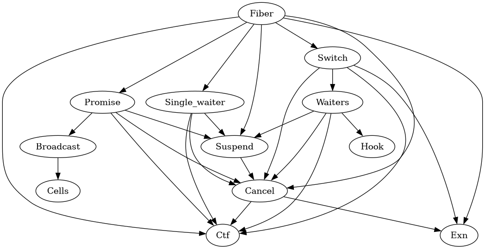

# Eio Core

Eio has many abstractions built on top of the Eio.core module, like networking, semaphores, ...
We focus on just the core module which implements fibers.

The dependency visualization is created by the following (and edited manually to remove everything except the subtree of `Fiber`)

```
codept lib_eio/*.ml lib_eio/core/*.ml -modules -dot | dot -Tpng > codept.png
```



We can see that even if we just focus on the `Fiber` module we already have
dependencies on a lot of other modules. Some of them might
[change before the 1.0 release](https://github.com/ocaml-multicore/eio/issues/388).

| Module        | Use                                                                                                                                                                                                                                                                            | Stable?                                                 |
| ------------- | ------------------------------------------------------------------------------------------------------------------------------------------------------------------------------------------------------------------------------------------------------------------------------ | ------------------------------------------------------- |
| Fiber         | Defines the Fork effect to start a new fiber and several variations of the fork function (normal fork, fork as daemon, fork as promise, etc.)                                                                                                                                  |
| Switch        | A context manager for fiber resources. Has some convenience methods for running fibers in new or existing cancellation contexts.                                                                                                                                               |                                                         |
| Exn           | Various exceptions used in Eio.                                                                                                                                                                                                                                                |
| Single_waiter | Version of `Waiters` where only a single fiber can be waiting. (If another fiber would try to wait, the first one is forgotten and never resumed.)                                                                                                                             |
| Cancel        | The hierarchy of cancellation contexts to cancel fibers. Each fiber is associated with one cancellation context. Fibers will sometimes check if they are cancelled and then raise an exception (e.g. when resuming from a yield, or when doing an operation that would block). |
| Suspend       | Performing the Suspend effect which should make a scheduler suspend the current fiber. The suspend effect carries the function that gets the fiber context and `enqueue` function to arrange for the fiber to be enqueued in the run-queue again.                              |
| Promise       | An implementation of promises that can be awaited and resolved. (Not sure why they use the Obj.magic, variance and injectivity type attributes) Internally, it uses broadcast to be able to keep a list of waiting fibers and wake them up at once.                            |
| Waiters       | Keeps a list of suspended fibers that are waiting for an event. The standard case seems to be that await uses the Suspend effect and then calls the enqueue function provided by the scheduler when the fiber should be woken up.                                              | [no](https://github.com/ocaml-multicore/eio/issues/382) |
| Hook          | Used if a fiber that is in the waiting list is cancelled and the waiting list is used in multiple domains. The hook then reaquires the mutex before removing the cancelled fiber from the list.                                                                                |
| Broadcast     | Keeps a list of suspended fibers that are waiting for an event. The difference to `Waiters` seems to be that in a `Broadcast` all have to be awoken at the same time and individual fibers can be cancelled.                                                                   |                                                         |
| Cells         | The underlying CQS implementation. Can be parameterized by the type of value in the Cell. To ger a complete CQS you specify the type of Cell and write `suspend` and `resume` functions.                                                                                       |
| Ctf           | It is is just used for tracing.                                                                                                                                                                                                                                                |

In total these have about 1300 lines of code.

```
$ cloc lib_eio/core/{fiber.ml,switch.ml,exn.ml,single_waiter.ml,cancel.ml,suspend.ml,promise.ml,waiters.ml,hook.ml,broadcast.ml,cells.ml}
-------------------------------------------------------------------------------
Language                     files          blank        comment           code
-------------------------------------------------------------------------------
OCaml                           11            273            238           1285
```

So, we probably have to cut down the scope. Some dependencies between modules:

### Fiber

- Promise: for placing the resulting value and to await the completion of other fibers.
- Switch: for resource management
- Suspend: inherent
- Single_waiter: Weak, Seems to be only used for the "concurrent list
  operations" inner module.

### Promise

Hard dependencies on Suspend, Cancel & Broadcast

### Switch

Needs Cancel but Waiters might be replaced by Single_waiter.
